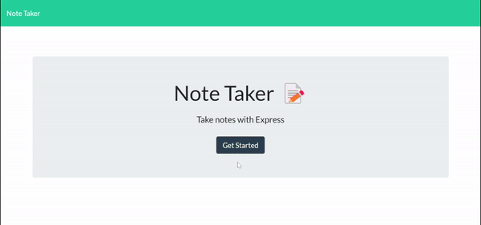

# 11 Note Taker

## Description

An application called Note Taker that can be used to write and save notes. This application uses an Express.js back end and will save and retrieve note data from a JSON file.

## Table of Contents

1. [Usage](#usage)
  1. [Screenshot](#screenshot)
  2. [URL](#url)
2. [License](#license)
3. [Contributing](#contributing)
4. [Tests](#tests)
5. [Questions](#questions)
## Usage

- Upon opening the application a user is presented with a landing page with a link to a notes page.
- The notes page has existing notes listed on the left and empty fields to enter a new note on the right.
- When a notes title and text is entered a save button appears - saving a note will add the note to the list on the left.
- Clicking on a note title on the left will display that note and its text on the right.
- A write note icon in the navigation allows a user to enter a new note.
- Notes can be removed by clicking the delete icon next to each note  on the left.

### Screenshot

### URL

https://bgnotetaker.herokuapp.com/

## License

This project is covered under the MIT License.

## Contributing

Ben Growcott - [GitHub](https://github.com/BGrowcott)

## Questions

If you have any questions or suggestions please contact me via my GitHub or Email:

[GitHub](https://github.com/BGrowcott)

[Email](mailto:bg.coding101@gmail.com)